Alice Hua - Derrick Xiong - Alex Kihiczak  
10/12/2020

### 1. An Introduction

In December 2019, COVID-19 coronavirus was first identified in the Wuhan
region of China, By March 11 2020, the 50 US states closed down many
public gathering events and businesses as policy measures to combat the
spread of the virus. This report uses data from the Centers for Disease
Control and Prevention, Kaiser Family Foundation, Raifman J et al 2020
paper of COVIS-19 state policy database and Google Covid-19 Community
Mobility Report. These datasets used here were last updated in Oct,
2020.

Our research question: Is there a causal relationship between young
adults proportion to the spread of COVID-19 cases? This research
question is motivated by recent reports and the substantial news
claiming that young adults play a major role in spreading the COVID-19
virus and contributing to increasing cases.  
A recent [report from the Centers for Disease Control and
Prevention](https://www.cdc.gov/mmwr/volumes/69/wr/mm6939e1.htm)
indicates that “During June–August 2020, COVID-19 incidence was highest
in persons aged 20–29 years.”Although the report is definitive evidence
of young adults recently reporting the most infections, what we don’t
know is how a state’s young adult population relates to the cases in the
entire state’s population. Similarly, the [World Health Organization
made a
statement](https://www.who.int/westernpacific/news/speeches/detail/virtual-press-conference-on-covid-19-in-the-western-pacific)
in August saying, “people in their 20s, 30s and 40s are increasingly
driving COVID-19’s spread.”  
Our research can help build a stronger understanding of this
relationship which is critical to developing useful health policies at
the state level. The outcome could suggest the possibility of policies
that target the young adult demographics to help fight the spread of
COVID-19 virus. It is also important as another means of informing young
adults of what their role in COVID-19 transmission really is; however,
this report will not by any means be a direct measure of that role. In
our investigation we expect to find that the estimate for the number of
cases per 100,000 conditioned on the proportion of young adults
consistent through multiple model specifications. In our models, we will
explore the possibility of other features or policies that may mitigate
or amplify the effect of differing young adult population percentages on
cases.

With a small sample of 50 data points, we operationalized the variables
as such:  
- The District of Columbia is an outlier because it is not a state, due
to its odd geography, with our goal of informing policy decision making
at a state level, we decided to exclude it from our entire analysis. A
criteria for leaving out the outlier is that if it was included as a
mistake, in this case, including DC would be similar to including a
county in a dataset of states. Since DC is a unique and small area of
land that is not representative of the rest of the statesits, data will
be very noisy. Our Classical Linear Model OLS is extremely sensitive to
such outliers, including it would produce a big effect on the estimated
model coefficients which will cost us precision in our estimates.  
- Cases: the number of cases per 100,000 people which we operationalized
as our outcome variable. - Adults 19-34: aggregated from proportions of
adults from 16-25 and 26-34. We conceptualize young adults from 19 to 34
who are likely to be working or going to school which implies an active
lifestyle that might have a connection with cases. This age group is one
of the least likely to experience the symptoms and most likely continue
spreading the virus without knowledge. We believe that this variable
would help us understand how this demographic affects the number of
cases. We suspect that among the population, this group is likely to be
contributing to the spread of COVID cases.  
- Re\_time: the response time calculated as a measurement of days from
State of Emergency announcement to the dates that they closed
non-essential businesses. We assumed that various states announced their
State of Emergency appropriate to their economy and geography. Once we
find the average length of the response time, we will operationalize the
variable to have the following categories: never if a state never
responded, late if the state response time is more average response time
and early if the state response time is lower than average.  
- Density: population density per square miles. We expect that states
with denser populations will have higher spread of COVID-19 cases.  
- Mask: a binarized variable based on whether the state has legal
enforcement of mask mandate.  
- Days\_mask: days of mask mandates in public places implemented until
the last day of data collection. We expect that the longer the mask
mandate is in place, the fewer the cases.  
- Evict: a binary variable whether the state has stopped eviction
initiation of evictions overall or due to COVID related issues. We think
that a stop on eviction indirectly leads to a lower number of cases
because people who are evicted will more likely be homeless or without
shelter which can lead to an increase in cases.  
- Poverty: a percentage of people living under the federal poverty line
(2018). We think that a higher percentage would yield higher cases and
spread because people living under poverty might be more exposed to
COVID-19 virus.

### 2. Data Reading & Wrangling

    # A list of variables of interest
    key_vars <- c("State", "Case_Rate_per_100000", "State_of_emergency",
                  "Closed_other_non-essential_businesses", "Began_to_reopen_businesses_statewide", 
                  "Mandate_face_mask_use_by_all_individuals_in_public_spaces", 
                  "Population_density_per_square_miles",    
                  "Weekly_UI_maximum_amount_with_extra_stimulus_(through_July_31,_2020)_(dollars)", 
                  "Percent_living_under_the_federal_poverty_line_(2018)", "Adults_19-25",
                  "Adults_26-34", "No_legal_enforcement_of_face_mask_mandate")

    # Select those key variables 
    a <- read.xlsx("covid-19.xlsx",sheet =2, startRow = 2, sep.names = "_") %>% select(key_vars)

    # Filter out DC and rename all variables for ease of use later
    a <- a %>%
      mutate(adults_19_34 = (`Adults_19-25` + `Adults_26-34`)*100) %>%
      filter(State != 'District of Columbia') %>%
      rename(cases = Case_Rate_per_100000, 
            gov_assist = `Weekly_UI_maximum_amount_with_extra_stimulus_(through_July_31,_2020)_(dollars)`,
            poverty = `Percent_living_under_the_federal_poverty_line_(2018)`,
            announce = State_of_emergency,
            mask = No_legal_enforcement_of_face_mask_mandate,
            density = Population_density_per_square_miles,
            bclosed = `Closed_other_non-essential_businesses`,
            dmask = `Mandate_face_mask_use_by_all_individuals_in_public_spaces`,
            bopened = `Began_to_reopen_businesses_statewide`) %>% 
      select(-c(`Adults_19-25`, `Adults_26-34`))

    # Get dates, this will convert any 0 input from the raw data to 1899 as default
    date_func <- function(x){convertToDate(x, origin = "1900-01-01")}
    a[3:6] <- lapply(a[3:6], date_func)
    head(a)

    ##        State cases   announce    bclosed    bopened      dmask density
    ## 1    Alabama  3870 2020-03-13 2020-03-28 2020-04-30 2020-07-16   93.24
    ## 2     Alaska  1960 2020-03-11 2020-03-24 2020-04-24 2020-04-24    1.11
    ## 3    Arizona  3381 2020-03-11 2020-03-31 2020-05-08 1899-12-30   62.91
    ## 4   Arkansas  3640 2020-03-11 2020-04-06 2020-05-04 2020-07-20   56.67
    ## 5 California  2308 2020-03-04 2020-03-19 2020-05-08 2020-06-18  241.65
    ## 6   Colorado  1791 2020-03-11 2020-03-19 2020-05-01 2020-07-16   54.72
    ##   gov_assist poverty mask adults_19_34
    ## 1        875    16.8    1           21
    ## 2        970    10.9    0           22
    ## 3        840    14.0    0           21
    ## 4       1051    17.2    0           21
    ## 5       1050    12.8    1           23
    ## 6       1218     9.6    0           23

Here we’ve got the cleaned, main dataframe for COVID-19, we’ll transform
these variables and get policy data next to create our final dataframe.

    # Get number of days between emergency and closing business
    response <- a %>% select(State, announce, bclosed, dmask, bopened) %>%
      mutate(response = as.numeric(bclosed - announce))

    # States with 0 as date for any dates will inherit 43903 as default after date conversion 
    # We will filter them and reassign 0 as the states would be for never acted on closing
    response$response[response$response == -43903] <- 0

    # Get a summary of the number of days between emergency announcement and closing time
    summary(response$response)

    ##    Min. 1st Qu.  Median    Mean 3rd Qu.    Max. 
    ##    0.00   12.25   15.00   15.66   20.00   27.00

    # Based on the summary stats above for response, we will encode categories of 
    # response types
    response <- response %>%
      mutate(days_closed = as.numeric(bopened - bclosed)) %>%
      mutate(re_time = case_when(response == 0 ~ 'never',
                                 response == 15 ~ 'average',
                                 response > 15 ~ 'late',
                                 response < 15 ~ 'early')) %>%
      mutate(days_mask = as.numeric(as.Date("2020-10-30") - dmask)) %>%
      mutate(days_mask = replace(days_mask, days_mask == 44134, 0),
                             response = replace(response, response < 0, 0)) %>%
      select(-c(bclosed, bopened, announce, dmask))

    # Get COVID policies from policy worksheet
    for (sheet in c("Housing", "Quarantine Rules")) {
      if (sheet == "Housing") {
        df_h <- read.xlsx("COVID-19 US state policy database (CUSP).xlsx",
                    sheet = sheet, 
                    startRow = 1, 
                  sep.names = "_") %>% 
        select(State, 'Stop_Initiation_of_Evictions_overall_or_due_to_COVID_related_issues',
                "State_Abbreviation") %>%
        rename(evict = 'Stop_Initiation_of_Evictions_overall_or_due_to_COVID_related_issues',
                abbr = "State_Abbreviation")
      } else {
        df_q <- read.xlsx("COVID-19 US state policy database (CUSP).xlsx",
                    sheet = sheet, 
                    startRow = 1, 
                  sep.names = "_") %>% 
        select(State, 'Mandate_quarantine_for_all_individuals_entering_the_state_from_another_state') %>%
        rename(quar = 'Mandate_quarantine_for_all_individuals_entering_the_state_from_another_state')
          }
    }
    pol <- full_join(df_h, df_q) %>% mutate(
      quar = case_when(quar > 0 ~ 1,
                      quar == 0 ~ 0),
      evict = case_when(evict > 0 ~ 1,
                      evict == 0 ~ 0))

    # joining policies, response dataframes to original dataframe
    a <- a %>% 
      left_join(pol, by = 'State') %>%
      left_join(response, by = 'State') %>%
      select(-c(bclosed, bopened, announce, dmask))

    head(a)

    ##        State cases density gov_assist poverty mask adults_19_34 evict abbr quar
    ## 1    Alabama  3870   93.24        875    16.8    1           21     0   AL    0
    ## 2     Alaska  1960    1.11        970    10.9    0           22     1   AK    1
    ## 3    Arizona  3381   62.91        840    14.0    0           21     0   AZ    0
    ## 4   Arkansas  3640   56.67       1051    17.2    0           21     0   AR    0
    ## 5 California  2308  241.65       1050    12.8    1           23     0   CA    0
    ## 6   Colorado  1791   54.72       1218     9.6    0           23     1   CO    0
    ##   response days_closed re_time days_mask
    ## 1       15          33 average       106
    ## 2       13          31   early       189
    ## 3       20          38    late         0
    ## 4       26          28    late       102
    ## 5       15          50 average       134
    ## 6        8          43   early       106

### 3. Exploratory Data Analysis

With all the necessary variables in place, we will look at how the
outcome variable (num of cases per 100k) is distributed along with our
key predictor variable adults from 19 to 34.

    summary(a$cases)

    ##    Min. 1st Qu.  Median    Mean 3rd Qu.    Max. 
    ##     344    2006    2726    2756    3524    5589

    summary(a$adults_19_34)

    ##    Min. 1st Qu.  Median    Mean 3rd Qu.    Max. 
    ##   18.00   20.00   21.00   20.82   21.00   25.00

    # Look at how cases are distributed
    case_hist <- a %>% 
      ggplot(aes(x = cases)) +  
      geom_histogram(fill='lightblue', binwidth = 300, color='black', alpha=.9) + 
      labs(title = "COVID-19 US Cases per 100k", y = 'Frequency') +
      theme(plot.title = element_text(hjust = 0.5))

    adult_scatter <- ggplot(a, aes(y=cases, x = adults_19_34)) + 
      geom_point() + 
      geom_smooth(method=lm) + 
      labs(title = "COVID-19 cases per 100k & Adults 19 to 34 %")

    case_hist | adult_scatter

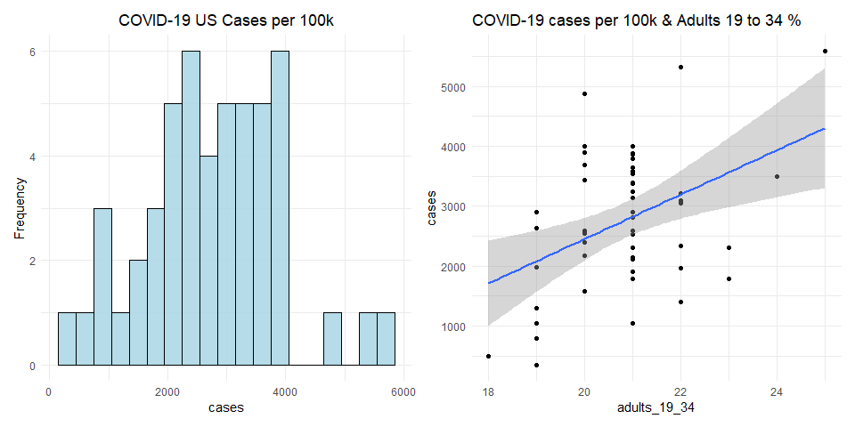 The
summary stats tells us that our outcome variable (cases per 100k) has a
mean around 2,756, median around 2,726 and 5,589 cases maximum given a
state. Notice that we have a somewhat sparse representation of a normal
distribution, there are the 3 states with highest cases in the far right
with over 4,000 cases. Furthermore, the scatterplot on the right shows a
positive trend between cases and proportions of adults from 19 to 34
with the mean and median around 20-21% and max of 25% per state.

    a[a$cases > 4000, ] %>% select(State, re_time, cases, adults_19_34)

    ##           State re_time cases adults_19_34
    ## 32     New York average  5324           22
    ## 34 North Dakota   early  5589           25
    ## 41 South Dakota   never  4874           20

We see that North Dakota, South Dakota and New York have the highest
number of cases (more than 4000 cases per 100K people). These are the
states in the far right of the histogram earlier. Two of them also have
above average percentages of adults from 19 to 34. Although South Dakota
has an average percentage of this demographic, it is next to North
Dakota geographically and thus can influence each others’ number of
cases.  
It’d be better to see a choropleth map of the States with numbers of
COVID-19 cases as we suspect that there is geographic dependency.

Below is EDA for response time, number of cases and adults from 19 to
34.

    map_us <- a %>% 
      mutate(state = tolower(State)) %>% 
      select(state, adults_19_34, cases)

    cases_map <- plot_usmap(data = map_us, 
                            values = "cases",
                            labels = T)+
      scale_fill_viridis(option = "viridis", 
                         direction = -1, 
                         alpha=.8, 
                         name = "Cases per 100k") +
      ggtitle("COVID-19 Cases per 100k People by State") + 
      theme(plot.title = element_text(hjust =0.5)) +
      theme(legend.position = "right")

    adult_map <- plot_usmap(data = map_us,
                            values = "adults_19_34", 
                            labels = T)+
      scale_fill_viridis(option = "viridis", 
                         direction = -1, 
                         alpha=.9,
                         name = "% Adults 19 to 34 ") +
      ggtitle("Proportion of Adult 19 to 34 by State") +
      theme(plot.title = element_text(hjust =0.5)) +
      theme(legend.position = "right")

    cases_map / adult_map

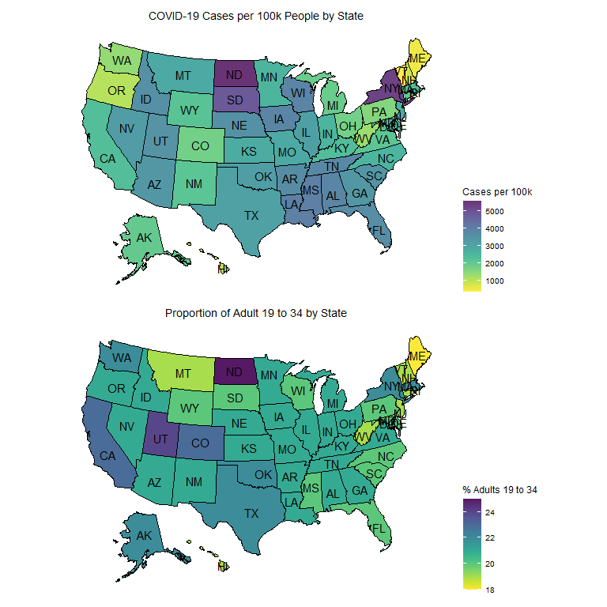 While we
hypothesized that higher proportions of adults contribute to increases
in the number of COVID-19 cases, and this map shows some evidence of
this relationship, it is possible that number of cases is not solely
caused by the proportion of adults alone. As we can see here there is a
geographic dependency in our outcome variable, states right next to each
other tend to have similar numbers of cases. We also think that the
response time to closing none-essential business is affecting the number
of cases. Let’s look at the response times list for all states for a
more complete story.

    # Creating a table for response time
    # Create even lengths for each category for dataframe
    t <- a %>% select(re_time, State) 
    average <- c(t$State[t$re_time == "average"], rep('', 42))
    early <- c(t$State[t$re_time == "early"], rep('', 31))
    never <- c(t$State[t$re_time == "never"], rep('', 49))
    late <- c(t$State[t$re_time == "late"], rep('', 28))
    re <- data.frame(early_response = early,
                     average_response= average, 
                     late_response = late, 
                     never_response = never)
    re %>% head(20)

    ##    early_response average_response  late_response never_response
    ## 1          Alaska          Alabama        Arizona   South Dakota
    ## 2        Colorado       California       Arkansas               
    ## 3     Connecticut        Minnesota        Florida               
    ## 4        Delaware    New Hampshire        Georgia               
    ## 5           Idaho         New York         Hawaii               
    ## 6        Illinois             Ohio        Indiana               
    ## 7       Louisiana           Oregon           Iowa               
    ## 8           Maine     Pennsylvania         Kansas               
    ## 9   Massachusetts                        Kentucky               
    ## 10       Michigan                        Maryland               
    ## 11         Nevada                     Mississippi               
    ## 12     New Jersey                        Missouri               
    ## 13     New Mexico                         Montana               
    ## 14   North Dakota                        Nebraska               
    ## 15        Vermont                  North Carolina               
    ## 16       Virginia                        Oklahoma               
    ## 17  West Virginia                    Rhode Island               
    ## 18      Wisconsin                  South Carolina               
    ## 19        Wyoming                       Tennessee               
    ## 20                                          Texas

Here we see that the type of response time per state also accounts for
some of the cases in combination with proportion of adults from 19 to
34. Both of these predictors are interacting with the geographic
clustering effect as we look at states like South and North Dakota, Iowa
and Wisconsin. North Dakota closed their businesses early relative to
its State of Emergency announcement, but it still has one of the highest
cases which can be partially be explained by being next to its neighbor
South Dakota who never closed their businesses and have a high number of
cases. Similarly, one can observe the clustering effect in the
choropleth map above, Wisconsin responded early but still has relatively
higher cases than other states because it’s neighboring Iowa who
responded late, same is true for other clusters of South/Eastern States
(Louisiana, Mississippi, Tennessee, Atlanta), and Western States (Idaho,
Nevada, Utah and Arizona).

Let’s look at a scatterplot matrix of the variables we are interested in
because we think they can help us explain the spread of COVID-19. These
variables are median income, government financial assistance amount,
mobility change for retail and recreation, adults from 19-34, and
response time.

    vars <- c("cases",  "adults_19_34", "gov_assist", "density", "days_mask")
    scatterplotMatrix(a[,vars])

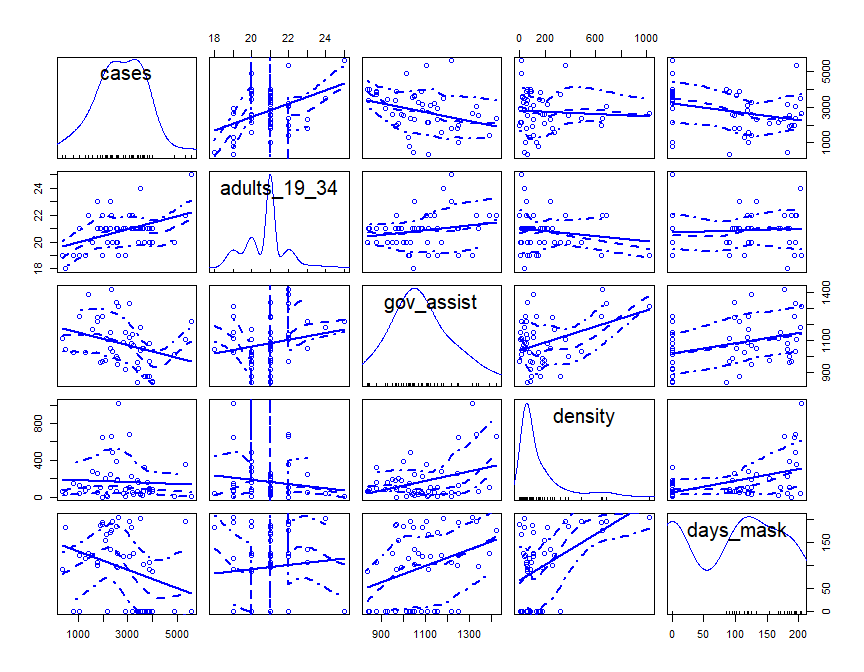 The plot
of adults from 19 to 34 variable shows an upward trend with number of
cases compared to the government financial assistance variable which has
a clear downward trend. Both variables show the trends consistent to our
initial hypothesis about them. The lower number of cases for the
gov\_assist variable could be because when people receive government
financial assistance, they reduced outside working hours, particularly
for the blue-collar workers who cannot afford to work from home or get
laid off due to COVID-19; reducing work hours outside and staying home
result in lower chance of transmission and thus cases. We are also
mindful that there are high outliers in both the adult\_19\_34 and
gov\_assist variables which could influence our estimated coefficients
significantly. Additionally, the density variable doesn’t have a very
clear trend which counters our initial expectations. Also the days of
mask worn variable has a slight downward trend but the mix of outcomes
counters our initial expectation that the longer masks are mandated in
public places, the lower the cases would be. Indeed, it looks like the
duration of the mask mandate doesn’t affect the number of cases
significantly, this leads us to include mask as an indicator variable to
measure the difference in whether the state has a mask mandate in place
at al1.

To follow up with our previous scatterplot matrices, the correlation
matrix can help us understand how correlated our variables are to cases
and each other. We will also add other covariates that we are thinking
of including for different model specifications.

    vars2 <- c("poverty")
    corr <- a %>% 
        select(c(vars, vars2)) %>% 
        drop_na()

    corrplot(cor(corr),method = "color",order="AOE", tl.cex = 0.8, cl.cex = 0.5,
                       diag=FALSE, addCoef.col = "white", addCoefasPercent = TRUE)

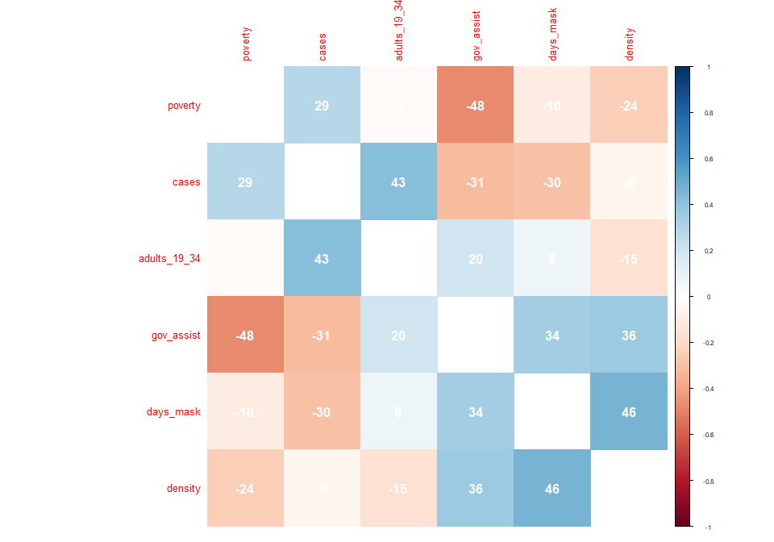 From this
correlation matrix, we see that the number of COVID-19 cases has a
positive correlation with adults from 19 to 34 and poverty. In contrast,
the cases variable is negatively correlated with both government
financial assistance, and days of mask worn, but not so much with
density.

### 4. Our Models:

#### Model 1:

We specify our model 1 as:  
*c**a**s**e**s*\_*p**e**r*\_100*k* = *β*0 + *β*1*a**d**u**l**t**s*\_19\_34 + *u*

    # Run models 1 
    m1 <- lm(cases ~ adults_19_34 , data=a)

    # Get 2 types of standard errors
    se.classic1 <- data.frame(m1$coefficients)$std..Error
    se.mrobust1 <- coeftest(m1, vcovHC)[ , "Std. Error"]

    # Print result
    stargazer(m1, m1, type="text", 
              se=list(se.classic1, se.mrobust1),
              title = "OLS Model 1: OLS with Robust and CLM Standard Error")

    ## 
    ## OLS Model 1: OLS with Robust and CLM Standard Error
    ## ==========================================================
    ##                                   Dependent variable:     
    ##                               ----------------------------
    ##                                          cases            
    ##                                    (1)            (2)     
    ## ----------------------------------------------------------
    ## adults_19_34                    370.464***    370.464***  
    ##                                 (113.464)      (140.819)  
    ##                                                           
    ## Constant                       -4,957.257**   -4,957.257* 
    ##                                (2,366.974)    (2,923.685) 
    ##                                                           
    ## ----------------------------------------------------------
    ## Observations                        50            50      
    ## R2                                0.182          0.182    
    ## Adjusted R2                       0.165          0.165    
    ## Residual Std. Error (df = 48)   1,048.424      1,048.424  
    ## F Statistic (df = 1; 48)        10.660***      10.660***  
    ## ==========================================================
    ## Note:                          *p<0.1; **p<0.05; ***p<0.01

Model one tells us that the each percent increase of adults from 19 to
34 is predicted to increase COVID-19 cases to another 370 cases per 100k
people with a classical standard error of about 113 cases and 141 cases
for robust standard error. The two errors are not wildly different but
we will examine the CLM assumption of Homoskedastic error later to
justify which type of error calculation is appropriate. In both types of
errors, the coefficient is the same with a statistically significant
result of less than .01.

#### Model 2:

We specified model 2 as:  
*c**a**s**e**s*\_*p**e**r*\_100*k* = *β*0 + *β*1*a**d**u**l**t**s*\_19\_34 +  + *β*2*g**o**v*\_*a**s**s**i**s**t* + *u*

    # Run models 2 
    m2 <- lm(cases ~ adults_19_34  + gov_assist + as.factor(re_time), data=a)

    # Get 2 types of standard errors
    se.mrobust2 <- coeftest(m2,  vcovHC(m2, type = 'HC1'))[ , "Std. Error"]
    se.classic2 <- data.frame(m2$coefficients)$std..Error

    # Print result
    stargazer(m2, m2, type="text", 
              se=list(se.classic2, se.mrobust2),
              title = "OLS Model 2: Comparing Robust and CLM Standard Error")

    ## 
    ## OLS Model 2: Comparing Robust and CLM Standard Error
    ## ==========================================================
    ##                                   Dependent variable:     
    ##                               ----------------------------
    ##                                          cases            
    ##                                    (1)            (2)     
    ## ----------------------------------------------------------
    ## adults_19_34                    452.011***    452.011***  
    ##                                  (99.766)      (135.072)  
    ##                                                           
    ## gov_assist                      -2.889***      -2.889***  
    ##                                  (0.913)        (0.911)   
    ##                                                           
    ## as.factor(re_time)early          100.185        100.185   
    ##                                 (379.936)      (495.709)  
    ##                                                           
    ## as.factor(re_time)late           430.069        430.069   
    ##                                 (376.487)      (467.629)  
    ##                                                           
    ## as.factor(re_time)never        2,576.633**   2,576.633*** 
    ##                                 (958.926)      (444.311)  
    ##                                                           
    ## Constant                       -3,813.851*    -3,813.851  
    ##                                (2,166.288)    (2,666.374) 
    ##                                                           
    ## ----------------------------------------------------------
    ## Observations                        50            50      
    ## R2                                0.453          0.453    
    ## Adjusted R2                       0.391          0.391    
    ## Residual Std. Error (df = 44)    895.487        895.487   
    ## F Statistic (df = 5; 44)         7.282***      7.282***   
    ## ==========================================================
    ## Note:                          *p<0.1; **p<0.05; ***p<0.01

With two additional covariates government financial assistance and
response time, model two is controlling for response time because each
state decision to closed down non-essential businesses varied and this
can cause differences in cases (COVID-19 spread is assumed here to be
higher when states did not respond in time relative to the emergency
announcement dates). For the baseline average response time, each
percent increase in the adult 19-34 is now predicted to increase 452
cases per 100K people. The model also shows a decrease in classical
standard error from 113 to 100 cases, and robust standard from 141 to
135. Due to some matrix multiplication under the hood of vcovHC
function, we were getting NAs for the default robust standard errors,
therefore, we decided to specify “HC1” (HC stands for
Heteroskedasticity-Consistent) for non-constant error estimate, although
“HC3” is the default robust standard error, we were only able to obtain
“HC1” which is still more conservative than the classical standard
errors.  
Our test then shows no evidence of an effect for both early or late
relative to the average response time due to very high standard errors.
However, for states in the never responded group, each percent increase
in adults 19 to 34 is now predicted to lead to an additional 2,577 cases
per 100k at a statistically significant level of .05 for classical
standard error, .01 for robust standard error.  
Additionally, each additional dollar in government financial assistance
is predicted to decrease COVID-19 cases by 3 per 100k people holding
other variables constant. The standard error for this variable is nearly
the same (.002 difference) for both classical and robust standard
errors. We will proceed with a F-test to check whether these additional
covariates actually improve the performance of our model.

    # # Run F test 
    anova(m2, m1, test = 'F')

    ## Analysis of Variance Table
    ## 
    ## Model 1: cases ~ adults_19_34 + gov_assist + as.factor(re_time)
    ## Model 2: cases ~ adults_19_34
    ##   Res.Df      RSS Df Sum of Sq      F   Pr(>F)   
    ## 1     44 35283478                                
    ## 2     48 52761306 -4 -17477827 5.4489 0.001186 **
    ## ---
    ## Signif. codes:  0 '***' 0.001 '**' 0.01 '*' 0.05 '.' 0.1 ' ' 1

Our F-test shows that the addition of 2 covariates government financial
assistance and response time to closing non-essential businesses do
indeed improve the explanatory power of our model by decreasing the sum
of squared residuals. This .001 level of significance tells us these
coefficients being different than 0 indeed produced a noticeable effect
for our model.

#### Model 3:

We specified our model 3 as:  
*c**a**s**e**s*\_*p**e**r*\_100*k* = *β*0 + *β*1*a**d**u**l**t**s*\_19\_34 +  + *β*2*g**o**v*\_*a**s**s**i**s**t* + *β*3*r**e*\_*t**i**m**e* + *β*4*d**e**n**s**i**t**y* + *β*5*d**a**y**s*\_*m**a**s**k* + *u*

    # Run model 3 
    m3 <- lm(cases ~ adults_19_34 + gov_assist + as.factor(re_time) + density + days_mask, data=a)

    # Get 2 types of standard errors
    se.mrobust3 <- coeftest(m3, vcovHC(m3, type = 'HC1'))[ , "Std. Error"]
    se.classic3 <- data.frame(m3$coefficients)$std..Error

    # Print result
    stargazer(m3, m3, type="text", 
              se=list(se.classic3, se.mrobust3),
              title = "OLS Model 3: Comparing Robust and CLM Standard Error")

    ## 
    ## OLS Model 3: Comparing Robust and CLM Standard Error
    ## ==========================================================
    ##                                   Dependent variable:     
    ##                               ----------------------------
    ##                                          cases            
    ##                                    (1)            (2)     
    ## ----------------------------------------------------------
    ## adults_19_34                    534.461***    534.461***  
    ##                                  (95.652)      (116.535)  
    ##                                                           
    ## gov_assist                      -3.379***      -3.379***  
    ##                                  (0.922)        (0.979)   
    ##                                                           
    ## as.factor(re_time)early          147.522        147.522   
    ##                                 (351.193)      (513.068)  
    ##                                                           
    ## as.factor(re_time)late           296.064        296.064   
    ##                                 (350.360)      (486.221)  
    ##                                                           
    ## as.factor(re_time)never        2,470.332***  2,470.332*** 
    ##                                 (895.916)      (443.029)  
    ##                                                           
    ## density                          2.010***      2.010***   
    ##                                  (0.688)        (0.543)   
    ##                                                           
    ## days_mask                        -4.391**      -4.391**   
    ##                                  (1.906)        (1.714)   
    ##                                                           
    ## Constant                       -4,882.229**  -4,882.229** 
    ##                                (2,020.308)    (2,236.755) 
    ##                                                           
    ## ----------------------------------------------------------
    ## Observations                        50            50      
    ## R2                                0.559          0.559    
    ## Adjusted R2                       0.485          0.485    
    ## Residual Std. Error (df = 42)    823.282        823.282   
    ## F Statistic (df = 7; 42)         7.590***      7.590***   
    ## ==========================================================
    ## Note:                          *p<0.1; **p<0.05; ***p<0.01

We have added two more covariates for model three, density and days of
mask worn. Based on the statistically significant estimates, our key
variable has increased from 452 to 534 with a decrease in both classical
and robust standard errors from model two. This tells us that each
percent of increase for adults from 19 to 34 is predicted to increase
cases by 534 for states with average response time, and an additional
2,470 cases for states that never responded (its standard errors are
also lower than model 2).

The test also shows the government financial assistance estimate has
changed very slightly from model 2. Each dollar in government assistance
is predicted to have a decrease in 3 cases still with similar standard
errors from model 2. While density was not strongly correlated with our
outcome variable cases from earlier EDA, including it in model 2
together with these other variables shows a statistical significant
estimate of 2 cases increase per unit increase of people/square mile.
Lastly, the days of mask worn (when mask mandate for all public spaces
is implemented to the last date of data collection Oct 30, 2020) has an
estimate that predicts a 4 cases difference with each day that mask is
mandated to be worn in all public spaces. Its classical and robust
standard errors are very similar and the result is at a .05 significance
level. Similarly, we will conduct a F-test to see whether there is an
improvement from our model two to three.

    # Run F test
    anova(m3, m2, test = 'F')

    ## Analysis of Variance Table
    ## 
    ## Model 1: cases ~ adults_19_34 + gov_assist + as.factor(re_time) + density + 
    ##     days_mask
    ## Model 2: cases ~ adults_19_34 + gov_assist + as.factor(re_time)
    ##   Res.Df      RSS Df Sum of Sq      F  Pr(>F)  
    ## 1     42 28467320                              
    ## 2     44 35283478 -2  -6816159 5.0282 0.01102 *
    ## ---
    ## Signif. codes:  0 '***' 0.001 '**' 0.01 '*' 0.05 '.' 0.1 ' ' 1

We have a .01 significance level that tells us our additional covariates
days of mask worn and density have coefficients other than 0 would
improve our model performance.

#### Model 4:

We specified our model 4 as:  
-
*c**a**s**e**s*\_*p**e**r*\_100*k* = *β*0 + *β*1*a**d**u**l**t**s*\_19\_34 +  + *β*2*g**o**v*\_*a**s**s**i**s**t* + *β*3*r**e*\_*t**i**m**e* + *β*4*d**e**n**s**i**t**y* + *β*5*d**a**y**s*\_*m**a**s**k* + *β*6*p**o**v**e**r**t**y* + *β*7*e**v**i**c**t* + *β*8*I*(*a**d**u**l**t**s*\_19\_34 \* *m**a**s**k*) + *u*

    # Run model 4 
    m4 <- lm(cases ~ adults_19_34 + gov_assist + as.factor(re_time) + days_mask + 
                     density + poverty + evict + I(adults_19_34*mask), data=a)

    # Get 2 types of errors
    se.mrobust4 <- coeftest(m4, vcovHC(m4, type = 'HC1'))[ , "Std. Error"]
    se.classic4 <- data.frame(m3$coefficients)$std..Error

    # Print result
    stargazer(m4, m4, type="text",
              se=list(se.classic4, se.mrobust4),
              title = "OLS Model RESET: Comparing Robust and CLM Standard Error")

    ## 
    ## OLS Model RESET: Comparing Robust and CLM Standard Error
    ## ==========================================================
    ##                                   Dependent variable:     
    ##                               ----------------------------
    ##                                          cases            
    ##                                    (1)            (2)     
    ## ----------------------------------------------------------
    ## adults_19_34                    538.967***    538.967***  
    ##                                  (96.401)      (114.630)  
    ##                                                           
    ## gov_assist                       -2.435**      -2.435**   
    ##                                  (1.042)        (1.046)   
    ##                                                           
    ## as.factor(re_time)early           43.785        43.785    
    ##                                 (359.392)      (501.915)  
    ##                                                           
    ## as.factor(re_time)late           159.143        159.143   
    ##                                 (350.375)      (462.869)  
    ##                                                           
    ## as.factor(re_time)never        2,444.227***  2,444.227*** 
    ##                                 (899.148)      (406.522)  
    ##                                                           
    ## days_mask                        -3.915*        -3.915*   
    ##                                  (2.026)        (2.053)   
    ##                                                           
    ## density                          2.035***      2.035***   
    ##                                  (0.686)        (0.569)   
    ##                                                           
    ## poverty                         107.469**      107.469**  
    ##                                  (51.845)      (50.873)   
    ##                                                           
    ## evict                            148.173        148.173   
    ##                                 (260.083)      (223.204)  
    ##                                                           
    ## I(adults_19_34 * mask)           -20.040        -20.040   
    ##                                  (15.393)      (17.492)   
    ##                                                           
    ## Constant                      -7,311.602***  -7,311.602***
    ##                                (2,313.646)    (2,504.544) 
    ##                                                           
    ## ----------------------------------------------------------
    ## Observations                        50            50      
    ## R2                                0.607          0.607    
    ## Adjusted R2                       0.507          0.507    
    ## Residual Std. Error (df = 39)    805.818        805.818   
    ## F Statistic (df = 10; 39)        6.030***      6.030***   
    ## ==========================================================
    ## Note:                          *p<0.1; **p<0.05; ***p<0.01

In our last model, we included three more covariates: poverty, evict (an
indicator) and an interaction term of adults\_19\_34 times mask (an
indicator). We hypothesized that the effect of these additional terms
could be absorbed by our key variable and including them would produce a
more precise estimate for our key variable. Even though poverty is
collinearity correlated with our government financial assistance model,
we think that this is not a perfect collinearity and also is safe to
include in our last model specification to test the robustness of our
key variable estimate. We included evict as an indicator term to
indicate 1 if the state has stopped eviction due to COVID-19 and 0
otherwise, we assumed that eviction will lead to higher cases because
people are likely to be without shelter and potentially be more exposed
to the spread. The interaction term for adults 19 to 34 and mask mandate
indicator is included because we hypothesized that young adults who wear
masks (assuming that they follow the mask mandate) and those who don’t
would produce a noticeable effect on a state’s cases per 100k.  
Our estimate for the adults 19 to 34 key variable stays almost identical
to our previous model three, for an average response time, the estimate
has gone up slightly from 534 to 538 cases per percent increase in this
demographic, and an additional 2,444 cases for states that never
responded with similar standard errors. We also see that the government
financial assistance estimate decreased by one case from model three
with a very small increase in standard errors, this could be that the
poverty estimate is taking some of the effect that government assistance
absorbed earlier. The poverty estimate shows a significant result,
telling us that a one percent increase in the percent living under the
poverty line is predicted to have 107 more cases per 100k people. Our
two other covariates added did not produce any noticeable effect and
have high standard errors. We will conduct an F-test to see if these
three covariates helped our model performance.

    # Run F test
    anova(m4, m3, test = 'F')

    ## Analysis of Variance Table
    ## 
    ## Model 1: cases ~ adults_19_34 + gov_assist + as.factor(re_time) + days_mask + 
    ##     density + poverty + evict + I(adults_19_34 * mask)
    ## Model 2: cases ~ adults_19_34 + gov_assist + as.factor(re_time) + density + 
    ##     days_mask
    ##   Res.Df      RSS Df Sum of Sq      F Pr(>F)
    ## 1     39 25324350                           
    ## 2     42 28467320 -3  -3142969 1.6134 0.2018

The F test shows a significance level above our threshold of .05, this
tells us that the three additional covariates included in model 4
specifications having coefficients different from 0 did not improve the
explanatory power of our model. We decide to stop here in the modeling
process and look at the RESET (Regression specification error test) to
see whether we are missing specific interaction or higher power terms.

    # Run RESET test
    a$m4_resid <- resid(m4)
    reset <- lm(cases ~ adults_19_34 + gov_assist + as.factor(re_time) + days_mask +
                  density + poverty + evict + I(adults_19_34*mask) + I(m4_resid**2) 
                + I(m4_resid**3), data=a)
    anova(reset, m4)

    ## Analysis of Variance Table
    ## 
    ## Model 1: cases ~ adults_19_34 + gov_assist + as.factor(re_time) + days_mask + 
    ##     density + poverty + evict + I(adults_19_34 * mask) + I(m4_resid^2) + 
    ##     I(m4_resid^3)
    ## Model 2: cases ~ adults_19_34 + gov_assist + as.factor(re_time) + days_mask + 
    ##     density + poverty + evict + I(adults_19_34 * mask)
    ##   Res.Df      RSS Df Sum of Sq      F    Pr(>F)    
    ## 1     37  7959435                                  
    ## 2     39 25324350 -2 -17364915 40.361 5.022e-10 ***
    ## ---
    ## Signif. codes:  0 '***' 0.001 '**' 0.01 '*' 0.05 '.' 0.1 ' ' 1

We created a different model that included the residuals cubed and
squared (stand for unexplained factors) in addition to all the
covariates of model four. The F-test between this model and our model
four shows that there evidence exists that higher order or interaction
terms have been omitted in model four. Due to the limitation of this
lab, we acknowledge that we cannot find all the missing terms and we did
what we could to examine the causal relationship between our key and
outcome variable using our four models.

    stargazer(m1, m2, m3, m4, type = "text",
              se = list(se.classic1, se.classic2, se.classic3, se.classic4),
              title = "Table 1: OLS models for COVID-19 Spread")

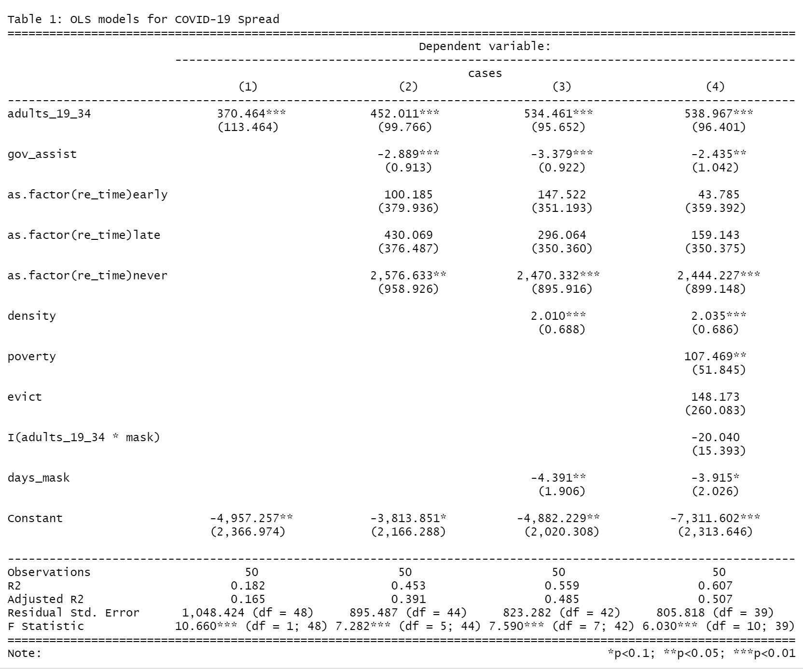

Overall, we observe that the estimate for our key variable remains
consistent with tight standard errors (for both classical and robust)
throughout different model specifications which provides strong evidence
that both magnitude and direction exists between young adults and the
number of COVID-19 cases. We have a clear and significant improvement
between each model up to model three. Even though model four explains
about 51% of the variance in number of cases per 100k, we would say that
model three is our most parsimonious and most interpretable out of four
models. We controlled for our key variable using response time,
government assistance and density. It seems to us that states that never
responded to enacting non-essential business closure policy and or have
a high proportion of adults in a higher density would inevitably result
in many COVID-19 cases. Furthermore, when state governments provide
stimulus as financial assistance there would be fewer cases to which we
can only attribute to the reasons stated above. Lastly, with all these
estimates and their implications when it comes to answering our causal
question, we would like to remind the readers that our estimates can
only tell us a relationship and direction, they are biased due to the
limitation of our model. Starting with the first geographic dependency
issue that we will discuss in the limitations of our model section.

### 5. Limitations of our Models

1.  Independent and Identically Distributed (IID)  
    We can consider the IID assumption for all four models at once. All
    four models likely violate the assumption of IID data. In terms of
    independent data, since the data is being reported at state level,
    there is almost certainly a substantial degree of geographical
    clustering. States that are near each other will not only likely
    have similar features that are relevant to the spread of a virus,
    but neighboring states also frequently exchange people. Because of
    this, the cases per 100,000 people in one state will have some
    dependency on the cases per 100,000 people in neighboring states. In
    terms of identically distributed, we can conceive of states as being
    randomly drawn from an infinite population of states to which we are
    interested in answering a causal relationship between COVID-19 cases
    and adults from 19 to 34. And 50 states are 50 data points that come
    from this infinite population of states. Thus, the independence
    assumption is not met while the identically distributed assumption
    is met. This will yield us estimates that are biased, which is an
    important reminder as we go forward with the model building process.

#### Model 1:

1.  Linear Conditional Expectation  
    We will evaluate the assumption of linear conditional expectation by
    examining the following plot of model predictions vs. model
    residuals.

<!-- -->

    a$m1_resid = resid(m1)
    a$m1_pred = predict(m1)

    m1_pred <- a %>%  
      ggplot(aes(x = m1_pred, y = m1_resid)) + 
      geom_point() + 
      stat_smooth(se = TRUE) + 
      ylim(c(-3000, 3000)) +
      scale_x_continuous(breaks = seq(1500, 5250, 500)) +
      labs(title = "Model 1: Prediction & Residuals")

    adult_scatter | m1_pred

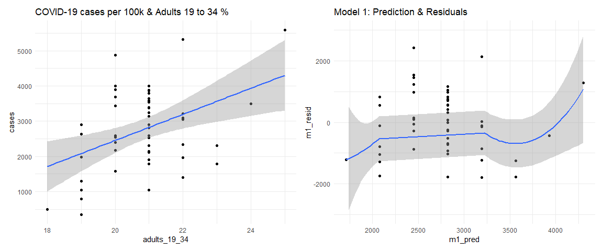

    boxcox(m1, lambda = seq(-1,4,0.1))

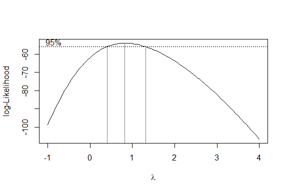 The pred
vs. residuals show an almost flat line with an exception of an outlier
at the extreme ends that distorts those residual means away from 0. This
boxcox plot shows what exponent transformation is appropriate given this
data for the maximum likelihood estimate. The highest peak for lambda is
nearly 1 which means an almost linear relationship between our x and y,
adults 19 to 34 and cases. Our model 1 meets the linear conditional
expectation assumption.

1.  No Perfect Collinearity  
    In our first model, the existence of any perfect or near perfect
    collinearities is not a concern as we have only one independent
    variable. This assumption is met.

2.  Homoskedastic errors

<!-- -->

    plot(m1, which=3)

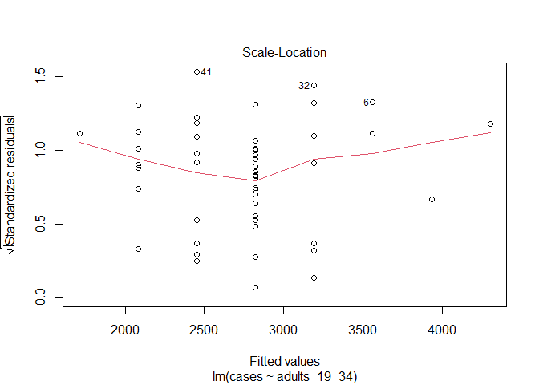

    lmtest::bptest(m1)

    ## 
    ##  studentized Breusch-Pagan test
    ## 
    ## data:  m1
    ## BP = 0.081256, df = 1, p-value = 0.7756

The Scale-Location plot verifies that the residuals are homoskedastic
(constant variance) because the red line is horizontal and nearly flat.
The Breusch-Pagan test’s p-value is insignificant and we fail to reject
the null hypothesis that there is no evidence of non-constant variance
(heteroskedastic errors). Our model 1 meets this homoskedastic errors
assumption.

1.  Normally distributed errors

<!-- -->

    m1_resid_hist <- a %>% 
      ggplot(aes(x = m1_resid)) + 
      geom_histogram(fill='lightblue', binwidth = 300, color='black', alpha=.9) + 
      labs(title = "Histogram of Model 1 Residuals") +
       theme(plot.title = element_text(hjust = 0.5))
     
    m1_qq <- a %>% 
      ggplot(aes(sample = m1_resid)) + 
      stat_qq() + 
      stat_qq_line() +
      labs(title = "Model 1 Normal QQ Plot") +
      theme(plot.title = element_text(hjust = 0.5))

    m1_resid_hist | m1_qq

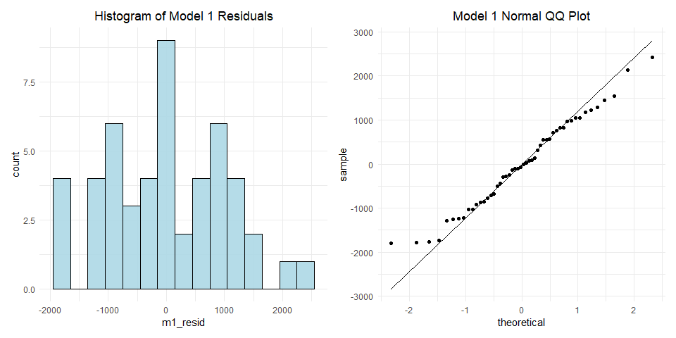 The
distribution appears to be very roughly normal, with perhaps some weird
behavior demonstrated on the left hand side of the qq plot. Although it
is not perfectly normal, we will go forward assuming that the model one
errors are normally distributed. Meeting this assumption along with the
homoskedastic assumption justifies our use of the classical standard
errors in model one because our uncertainty estimates are unbiased.

#### Model 2:

1.  Independent and Identically Distributed (IID)  
    This is addressed aboved for all models.

2.  Linear Conditional Expectation

<!-- -->

    a$m2_resid = resid(m2)
    a$m2_pred = predict(m2)

    m2_gov <- a %>%  
      ggplot(aes(x = gov_assist, y = m2_resid)) + 
      geom_point() + 
      stat_smooth(se = TRUE) + 
      labs(title = "Model 2: Government Assist & Residuals") +
      theme(plot.title = element_text(hjust = 0.5))
      

    m2_pred  <- a %>%  
      ggplot(aes(x = m2_pred, y = m2_resid)) + 
      geom_point() + 
      stat_smooth(se = TRUE) +
      labs(title = "Model 2: Prediction & Residuals") +
      theme(plot.title = element_text(hjust = 0.5))
      
      
    (m2_gov | m2_pred) 

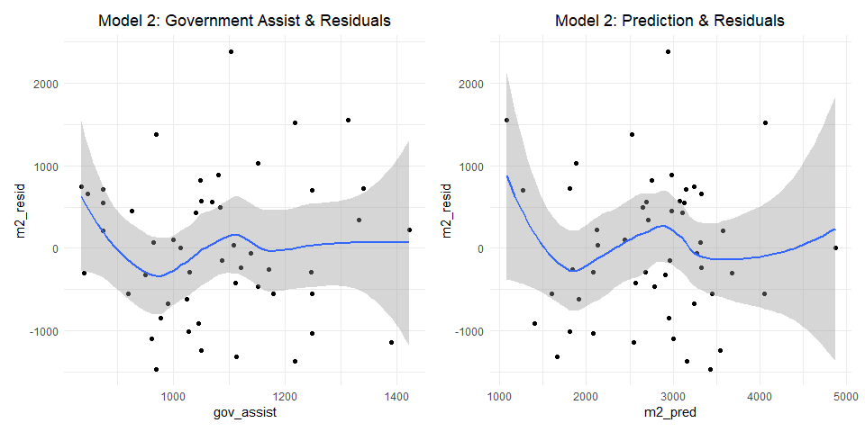

    boxcox(m2, lambda = seq(-2,6,0.2))

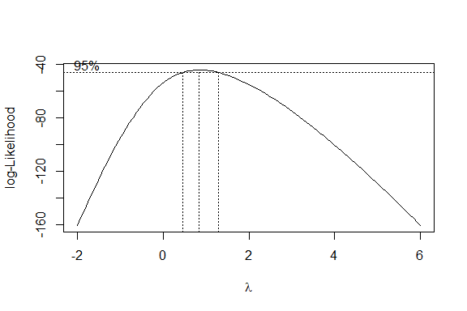 From the
plot we can safely assume that the conditional expectation is linear.
Although there is some slight curvature at the ends of the plot, this
seems to be caused by singular data points that skew the tails. We can
also observe that for the most part there doesn’t appear to be any major
concern regarding heteroskedastic errors. However, the standard error
does appear to flair out towards the right hand side of the residuals
vs. predictions plot, which could indicate a minor degree of
heteroskedastic errors. Our boxcox test shows that again the outcome
variable does not require any sort of transformation.

1.  No Perfect Collinearity

<!-- -->

    vif(m2)

    ##                        GVIF Df GVIF^(1/(2*Df))
    ## adults_19_34       1.059749  1        1.029441
    ## gov_assist         1.088250  1        1.043192
    ## as.factor(re_time) 1.063287  3        1.010280

We know that there is no perfect collinearity in model 2 since the model
did not drop any variables. We can also see by the values returned by
looking at the variance inflation factors, that there is not much
concern of collinearity impacting the model as all vifs are at around 1.

1.  Homoskedastic errors  
    We can investigate the possibility of heteroskedastic errors with
    the following statistical test, where the null-hypothesis is that
    there is no evidence of heteroskedastic errors.

<!-- -->

    plot(m2, which=3)

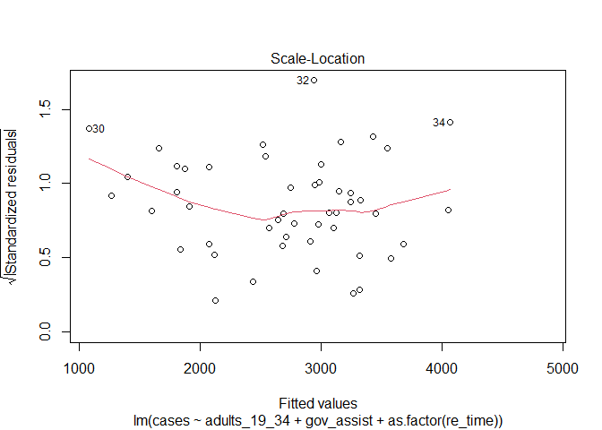

    lmtest::bptest(m2)

    ## 
    ##  studentized Breusch-Pagan test
    ## 
    ## data:  m2
    ## BP = 10.354, df = 5, p-value = 0.0658

We get a p-value of 0.0658 and therefore fail to reject the null
hypothesis. We again do not find any evidence to suggest heteroskedastic
errors; however this claim comes with less confidence than in model one.
The scale-location test, along with the plot of residuals
vs. predictions, both show some potential for minor heteroskedasticity.
Although we cannot rule out the possibility of heteroskedastic errors,
we will assume that model 2 has homoskedastic errors. This assumption is
safe to make as even if there are heteroskedastic errors, we can see
from the plots that the issue would be very minor. There is no sign of a
substantial issue with this assumption.

1.  Normally distributed errors  
    We can also check to see that the errors are normally distributed
    below.

<!-- -->

    m2_resid_hist <- a %>% 
      ggplot(aes(x = m2_resid)) + 
      geom_histogram(fill='lightblue', binwidth = 300, color='black', alpha=.9) + 
      labs(title = "Histogram of Model 2 Residuals") +
       theme(plot.title = element_text(hjust = 0.5))
     
    m2_qq <- a %>% 
      ggplot(aes(sample = m2_resid)) + 
      stat_qq() + 
      stat_qq_line() +
      labs(title = "Model 2 Normal QQ Plot") +
      theme(plot.title = element_text(hjust = 0.5))

    m2_resid_hist | m2_qq

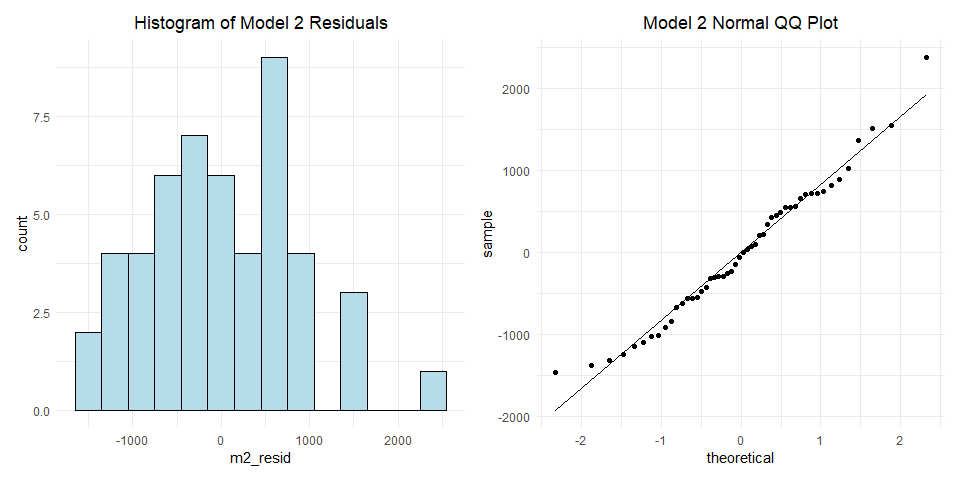 The
histogram of model two residuals appears to follow a roughly normal
distribution, and our qq plot supports the assumption of the normally
distributed errors. Meeting this assumption along with the homoskedastic
assumption justifies our use of the classical standard errors in model
two because our uncertainty estimates are unbiased.

#### Model 3:

1.  Independent and Identically Distributed (IID)  
    This is addressed aboved for all models.

2.  Linear Conditional Expectation

<!-- -->

    a$m3_resid = resid(m3)
    a$m3_pred = predict(m3)

    m3_dens <- a %>%  
      ggplot(aes(x = density, y = m3_resid)) + 
      geom_point() + 
      stat_smooth(se = TRUE) + 
      labs(title = "Model 3: Density & Residuals") +
      theme(plot.title = element_text(hjust = 0.5))
      
    m3_mask <- a %>%  
      ggplot(aes(x = days_mask, y = m3_resid)) + 
      geom_point() + 
      stat_smooth(se = TRUE) + 
      labs(title = "Model 3: Days of Mask & Residuals") +
      theme(plot.title = element_text(hjust = 0.5))
      

    m3_pred  <- a %>%  
      ggplot(aes(x = m3_pred, y = m3_resid)) + 
      geom_point() + 
      stat_smooth(se = TRUE) +
      labs(title = "Model 3: Prediction & Residuals") +
      theme(plot.title = element_text(hjust = 0.5))
      
    (m3_dens| m3_mask) / m3_pred

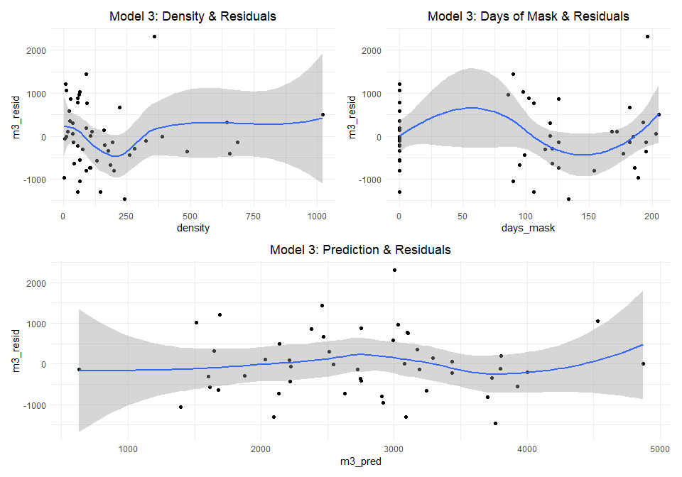

    boxcox(m3, lambda = seq(-2, 6, .2))

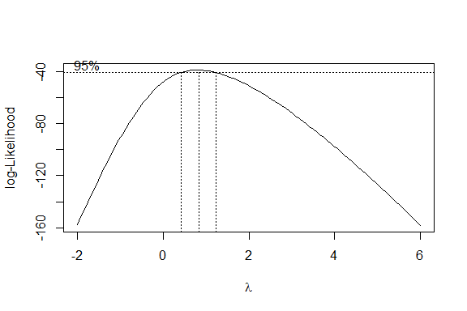 Although
there may be some non-linearity in the plots of predictions
vs. independent variables, there is nothing extremely non-linear, and
the curvature that occurs is possibly a feature of the line overfitting
to a smaller dataset. The curvature that we observe in the residuals
vs. days\_mask plot is likely due to the gap in data between states that
have had 0 days of a mask mandate and states that have had a mask
mandate, which in the lowest case has been close to 100 days. The boxcox
test again shows us that no transformation of our outcome variable is
necessary, as lambda is approximately 1.

1.  No Perfect Collinearity

<!-- -->

    vif(m3)

    ##                        GVIF Df GVIF^(1/(2*Df))
    ## adults_19_34       1.152506  1        1.073548
    ## gov_assist         1.313946  1        1.146275
    ## as.factor(re_time) 1.224849  3        1.034381
    ## density            1.483033  1        1.217798
    ## days_mask          1.535207  1        1.239035

We know there is no perfect collinearity in model 3 as no variables were
dropped from the model; by assessing the vif results we can also see
that there is little concern of any near perfect collinearity as the
inflation is never greater than 1.5.

We use the same process as before to investigate the possibility of
heteroskedastic errors, where the null-hypothesis is that there is no
evidence of heteroskedastic errors. 4. Homoskedastic errors

    plot(m3, which=3)

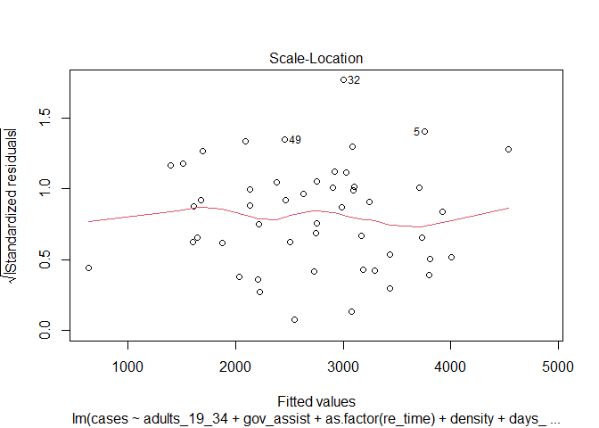

    lmtest::bptest(m3)

    ## 
    ##  studentized Breusch-Pagan test
    ## 
    ## data:  m3
    ## BP = 12.077, df = 7, p-value = 0.09807

We again find that there is not substantial evidence of heteroskedastic
errors; however, with a bit less confidence in this case since our
p-value for the Breusch-Pagan test is now 0.098. We can see from the
model three residuals versus predictions that the errors do appear to be
homoskedastic, with the exception of the widening standard errors on the
tails. In the plots for density and days\_mask there may be some slight
cause for concern as well. The scale-location plot does look generally
flat, which suggests the errors are homoskedastic. Ultimately, we will
assume that there is no heteroskedasticity for the sake of interpreting
our models, knowing that if it does in fact exist it is very minor.

1.  Normally distributed errors

<!-- -->

    m3_resid_hist <- a %>% 
      ggplot(aes(x = m3_resid)) + 
      geom_histogram(fill='lightblue', binwidth = 300, color='black', alpha=.9) + 
      labs(title = "Histogram of Model 3 Residuals") +
       theme(plot.title = element_text(hjust = 0.5))
     
    m3_qq <- a %>% 
      ggplot(aes(sample = m3_resid)) + 
      stat_qq() + 
      stat_qq_line() +
      labs(title = "Model 3 Normal QQ Plot") +
      theme(plot.title = element_text(hjust = 0.5))

    m3_resid_hist | m3_qq

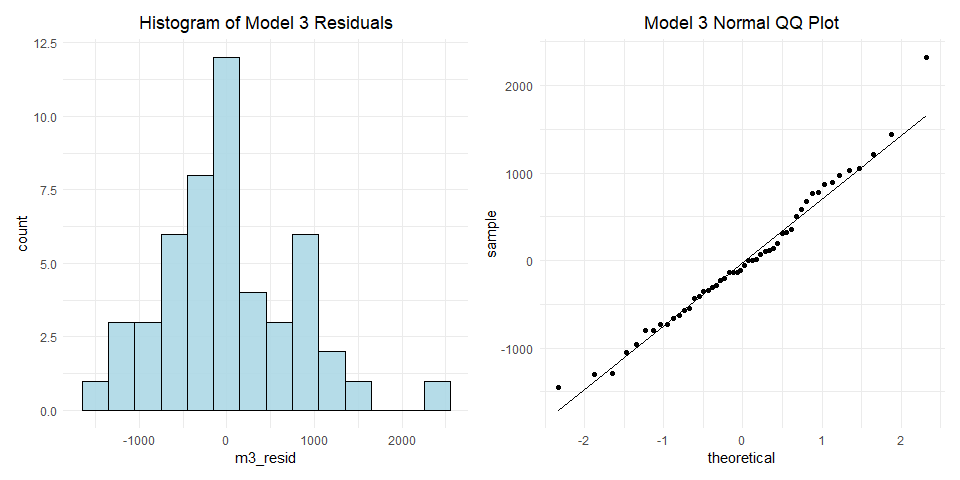 We see
that the model three residuals do follow a roughly normal distribution,
and the qq plot supports this statement. Meeting this assumption along
with the homoskedastic assumption justifies our use of the classical
standard errors in model three because our uncertainty estimates are
unbiased.

#### Model 4:

1.  Independent and Identically Distributed (IID)  
    This is addressed aboved for all models.

2.  Linear Conditional Expectation

<!-- -->

    a$m4_pred = predict(m4)

    m4_dens <- a %>%  
      ggplot(aes(x = density, y = m4_resid)) + 
      geom_point() + 
      stat_smooth(se = TRUE) + 
      labs(title = "Model 4: Density & Residuals") +
      theme(plot.title = element_text(hjust = 0.5))
      
    m4_mask <- a %>%  
      ggplot(aes(x = days_mask, y = m4_resid)) + 
      geom_point() + 
      stat_smooth(se = TRUE) + 
      labs(title = "Model 4: Days of Mask & Residuals") +
      theme(plot.title = element_text(hjust = 0.5))

    m4_pov <- a %>%  
      ggplot(aes(x = poverty, y = m4_resid)) + 
      geom_point() + 
      stat_smooth(se = TRUE) + 
      labs(title = "Model 4: Poverty & Residuals") +
      theme(plot.title = element_text(hjust = 0.5))

    m4_inter <- a %>%  
      ggplot(aes(x = adults_19_34*mask, y = m4_resid)) + 
      geom_point() + 
      stat_smooth(se = TRUE) + 
      labs(title = "Model 4: Adult*Mask & Residuals") +
      theme(plot.title = element_text(hjust = 0.5))

    m4_pred  <- a %>%  
      ggplot(aes(x = m4_pred, y = m4_resid)) + 
      geom_point() + 
      stat_smooth(se = TRUE) +
      labs(title = "Model 4: Prediction & Residuals") +
      theme(plot.title = element_text(hjust = 0.5))

    (m4_pov | m4_mask) / ( m4_inter | m4_pred )

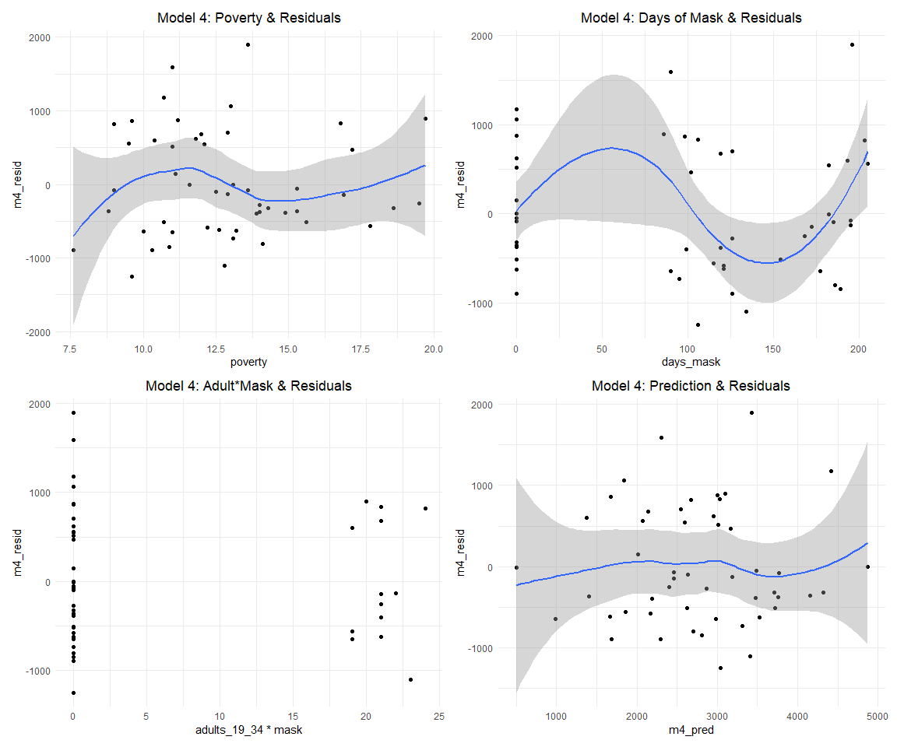 We can
see that overall the model prediction vs. residuals appears to be very
linear. Aside from a few minor concerns with some non-linearities in the
residuals vs. variables that have appeared in past models, poverty shows
a slight non-linear trend caused by one inconsistent data point on the
left hand side of the plot. This is not a substantial issue, and due to
the small data it is safe for us to assume that this relationship is
likely actually approximately linear.

    boxcox(m4, lambda = seq(-2,6,0.1))

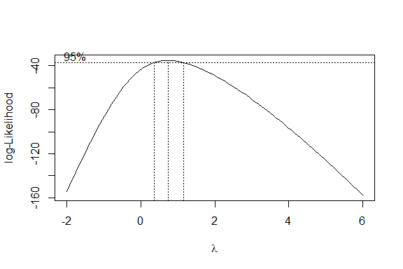 The peak
of the boxcox test is around lambda = 1 suggesting that a linear fit is
best for the data.

1.  No Perfect Collinearity

<!-- -->

    vif(m4)

    ##                            GVIF Df GVIF^(1/(2*Df))
    ## adults_19_34           1.221928  1        1.105409
    ## gov_assist             1.750285  1        1.322983
    ## as.factor(re_time)     1.457513  3        1.064802
    ## days_mask              1.811621  1        1.345965
    ## density                1.541579  1        1.241603
    ## poverty                1.624599  1        1.274597
    ## evict                  1.200063  1        1.095474
    ## I(adults_19_34 * mask) 1.546602  1        1.243624

There are no perfect collinearities in the model since no variables were
dropped by the model. We can also see from the variance inflation
factors that collinearity did not have a concerning impact on variance
inflation, as the values are all under 2.

1.  Homoskedastic errors

<!-- -->

    plot(m4, which=3)

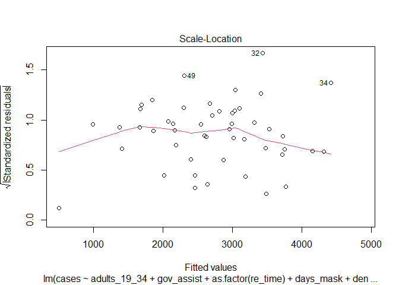

    lmtest::bptest(m4)

    ## 
    ##  studentized Breusch-Pagan test
    ## 
    ## data:  m4
    ## BP = 14.75, df = 10, p-value = 0.1414

Similar to in model three, there is not significant evidence of
heteroskedastic errors, as we fail to reject the null hypothesis with a
p-value of 0.141; however, there is a bit more concern than in models
one and two. We can see from the model four residuals versus predictions
that the errors do generally appear to be homoskedastic; although, we do
again observe the issue of a slight widening in the SEs at the ends of
the plot, suggesting there may be a minor issue of heteroskedasticity.
The scale-location plot is not perfectly flat, although it is generally
linear and horizontal. Ultimately, as in model three, we will assume
that there is no heteroskedasticity for the sake of interpreting our
models, with the knowledge that if there is heteroskedasticity, it is
very minor.

1.  Normally distributed errors

<!-- -->

    m4_resid_hist <- a %>% 
      ggplot(aes(x = m4_resid)) + 
      geom_histogram(fill='lightblue', binwidth = 300, color='black', alpha=.9) + 
      labs(title = "Histogram of Model 4 Residuals") +
       theme(plot.title = element_text(hjust = 0.5))
     
    m4_qq <- a %>% 
      ggplot(aes(sample = m4_resid)) + 
      stat_qq() + 
      stat_qq_line() +
      labs(title = "Model 4 Normal QQ Plot") +
      theme(plot.title = element_text(hjust = 0.5))

    m4_resid_hist | m4_qq

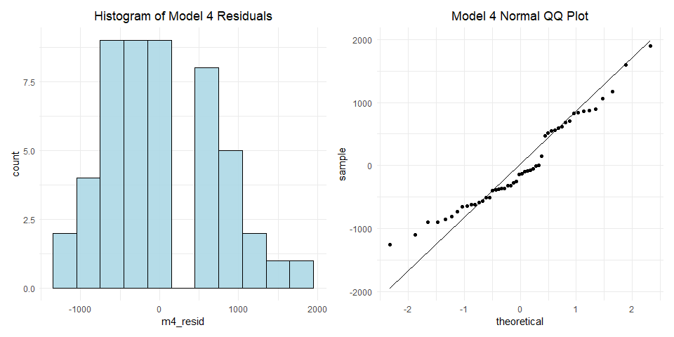 The
histogram of model four residuals shows that they are very roughly
normally distributed, which is substantiated by the qq plot. There is
some concern with values on the left hand side of the plot trending
above the line and a noticeable gap in the middle that both perturb the
normal distribution. Meeting this assumption along with the
homoskedastic assumption justifies our use of the classical standard
errors in model four because our uncertainty estimates are unbiased.

### 5. Discussion of Omitted Variables

Below is the summary table of our omitted variable analysis which we
will dive into:

<table>
<colgroup>
<col style="width: 20%" />
<col style="width: 26%" />
<col style="width: 32%" />
<col style="width: 20%" />
</colgroup>
<thead>
<tr class="header">
<th>Omitted Variable</th>
<th style="text-align: center;">Correlation to Outcome</th>
<th style="text-align: right;">Correlation to Explanatory</th>
<th style="text-align: right;">Direction of Bias</th>
</tr>
</thead>
<tbody>
<tr class="odd">
<td>income</td>
<td style="text-align: center;">Negative</td>
<td style="text-align: right;">Negative</td>
<td style="text-align: right;">Away from Zero</td>
</tr>
<tr class="even">
<td>65+</td>
<td style="text-align: center;">Negative</td>
<td style="text-align: right;">Negative</td>
<td style="text-align: right;">Away from Zero</td>
</tr>
<tr class="odd">
<td>illness</td>
<td style="text-align: center;">Negative</td>
<td style="text-align: right;">Negative</td>
<td style="text-align: right;">Away from Zero</td>
</tr>
<tr class="even">
<td>mobility</td>
<td style="text-align: center;">Positive</td>
<td style="text-align: right;">Negative</td>
<td style="text-align: right;">Towards Zero</td>
</tr>
<tr class="odd">
<td>responsibility</td>
<td style="text-align: center;">Positive</td>
<td style="text-align: right;">Negative</td>
<td style="text-align: right;">Towards Zero</td>
</tr>
</tbody>
</table>

    # Get data 
    omitted_vars <- c("Percent_at_risk_for_serious_illness_due_to_COVID", 
                      "Medicaid_Expenditures_as_a_Percent_of_Total_State_Expenditures_by_Fund", 
                      "Median_Annual_Household_Income", "65+", "Retail_&_recreation", "State")
    omit <- read.xlsx("covid-19.xlsx",sheet =2, startRow = 2, sep.names = "_") %>% 
      select(omitted_vars) %>%
      mutate(`65+` = 100*`65+`) %>%
      rename(income = 'Median_Annual_Household_Income',
        mobility = `Retail_&_recreation`,
        illness = Percent_at_risk_for_serious_illness_due_to_COVID,
        medicaid = Medicaid_Expenditures_as_a_Percent_of_Total_State_Expenditures_by_Fund) %>%
      inner_join(a, by = 'State')

    #Get the correlation between key and omit, leave out the last state that has NA for income
    cat("The correlation between income and our key variable is:", 
        cor(a$adults_19_34[1:49], na.omit(omit$income)))

    ## The correlation between income and our key variable is: -0.1899047

    # Run tests
    omit_m1a <- lm(cases ~ income, data = omit)
    omit_m1b <- lm(cases ~ adults_19_34 , data = omit)
    omit_m1c <- lm(cases ~ adults_19_34 + income, data = omit)

    # Print result
    stargazer(omit_m1a, omit_m1b, omit_m1c, type = 'text', omit.stat = 'all')

    ## 
    ## ==================================================
    ##                       Dependent variable:         
    ##              -------------------------------------
    ##                              cases                
    ##                  (1)          (2)          (3)    
    ## --------------------------------------------------
    ## income         -0.030*                   -0.022   
    ##                (0.016)                   (0.015)  
    ##                                                   
    ## adults_19_34               370.464***  335.836*** 
    ##                            (113.464)    (115.834) 
    ##                                                   
    ## Constant     4,584.163*** -4,957.257** -2,914.618 
    ##               (974.665)   (2,366.974)  (2,740.485)
    ##                                                   
    ## ==================================================
    ## ==================================================
    ## Note:                  *p<0.1; **p<0.05; ***p<0.01

-   The first omitted variable we have is the "Median Annual Household
    Income’’ variable that presents the household income for each state.
    If we construct an OLS model as above with cases per 100k, we can
    see it negatively correlates with the cases per 100000. Income is a
    very important variable in separating different groups of people who
    may be subject to Covid-19 differently. Our reasoning for the
    correlation between income and cases per 100k is that people with
    higher income can afford to stay at home or work from home and thus
    not be exposed to the virus while people who work blue collar or
    service industry jobs don’t have much freedom to work from home and
    thus more likely to contract the virus. Thus a higher average
    statewide household income corresponds to a lower number of cases
    per 100k people. In this case, our key variable is negatively
    correlated with median annual household income because young people
    generally make less money than older people. Since adults\_19\_34
    relates to cases positively and since income has negative
    relationships with both cases per 100k and adults\_19\_34, the bias
    is away from zero.

<!-- -->

    # Get correlation
    cat("The correlation between people of age 65+ and our key variable is:",
        cor(a$adults_19_34, omit$`65+`)) 

    ## The correlation between people of age 65+ and our key variable is: -0.6906499

    # Run tests
    omit_m2a <- lm(cases ~ `65+`, data = omit)
    omit_m2b <- lm(cases ~ adults_19_34 , data = omit)
    omit_m2c <- lm(cases ~ adults_19_34 + `65+`, data = omit)

    # Print result
    stargazer(omit_m2a, omit_m2b, omit_m2c, type = 'text', omit.stat = 'all')

    ## 
    ## ==================================================
    ##                       Dependent variable:         
    ##              -------------------------------------
    ##                              cases                
    ##                  (1)          (2)          (3)    
    ## --------------------------------------------------
    ## `65+`         -199.616**                 -57.394  
    ##                (77.992)                 (104.765) 
    ##                                                   
    ## adults_19_34               370.464***   310.663*  
    ##                            (113.464)    (158.051) 
    ##                                                   
    ## Constant     6,061.443*** -4,957.257** -2,761.767 
    ##              (1,300.669)  (2,366.974)  (4,663.271)
    ##                                                   
    ## ==================================================
    ## ==================================================
    ## Note:                  *p<0.1; **p<0.05; ***p<0.01

-   The second omitted variable we have is the percentage of people of
    age 65+. This demographic variable is interesting in that in our
    model 1, we find that states with higher percentages of young adults
    between 19-34 have higher number of cases and our reasoning is that
    younger people, because of their higher resistance to Covid-19, do
    not treat the safety measures as seriously as the older population.
    By the same reasoning, the higher the percentage of people of age
    65+, the lower the number of cases per 100k should be. Such
    observations can be confirmed from the linear model above. And
    generally speaking, higher percentages of young people should
    correspond to lower percentages of older people. Since the variable
    65+ correlates to cases negatively and the adults\_19\_34 variable
    negatively, we know that the direction of the variable “65+” is
    positive and thus its bias is away from zero.

<!-- -->

    cat("The correlation between percent at risk for illness and our key variable is:", 
        cor(a$adults_19_34, omit$illness))

    ## The correlation between percent at risk for illness and our key variable is: -0.5080421

    # Run test
    omit_m3a <- lm(cases ~ illness, data = omit)
    omit_m3b <- lm(cases ~ adults_19_34 , data = omit)
    omit_m3c <- lm(cases ~ adults_19_34 + illness, data = omit)

    # Print result
    stargazer(omit_m3a, omit_m3b, omit_m3c, type = 'text', omit.stat = 'all')

    ## 
    ## =================================================
    ##                      Dependent variable:         
    ##              ------------------------------------
    ##                             cases                
    ##                  (1)         (2)          (3)    
    ## -------------------------------------------------
    ## illness        -41.583                  36.616   
    ##               (45.422)                 (48.333)  
    ##                                                  
    ## adults_19_34              370.464***  421.391*** 
    ##                           (113.464)    (132.320) 
    ##                                                  
    ## Constant     4,347.274** -4,957.257** -7,418.913*
    ##              (1,745.972) (2,366.974)  (4,026.320)
    ##                                                  
    ## =================================================
    ## =================================================
    ## Note:                 *p<0.1; **p<0.05; ***p<0.01

-   The third omitted variable we have is the
    “Percent\_at\_risk\_for\_serious\_illness\_due\_to\_COVID’’. This
    variable measures the percent of a state’s population which would
    potentially suffer the worst, or die, from Covid. Interestingly,
    this variable is negatively correlated with cases per 100k. This
    could be because people who are extremely sick are more able to
    identify their illness and quarantine, because they may die rapidly
    from the disease and not spread it, or because people more at risk
    take greater precautions which lowers disease transmission. This
    variable is also negatively correlated to our key
    variable”aduilts\_19\_34" because the younger population is
    generally less likely to be subject to illness when contracting
    covid. Since this omitted variable is negatively correlated with the
    outcome variable and the key variable, the direction of the bias is
    towards zero.

<!-- -->

    cat("The correlation between mobility and our key variable is:",
        cor(a$adults_19_34, omit$mobility))

    ## The correlation between mobility and our key variable is: -0.08248071

    omit_m4a <- lm(cases ~ mobility, data = omit)
    omit_m4b <- lm(cases ~ adults_19_34 , data = omit)
    omit_m4c <- lm(cases ~ adults_19_34 + mobility, data = omit)

    stargazer(omit_m4a, omit_m4b, omit_m4c, type = 'text', omit.stat = 'all')

    ## 
    ## ===================================================
    ##                       Dependent variable:          
    ##              --------------------------------------
    ##                              cases                 
    ##                  (1)          (2)          (3)     
    ## ---------------------------------------------------
    ## mobility        37.973                   44.803*   
    ##                (26.217)                  (23.683)  
    ##                                                    
    ## adults_19_34               370.464***   387.770*** 
    ##                            (113.464)    (110.912)  
    ##                                                    
    ## Constant     3,295.778*** -4,957.257** -4,680.475**
    ##               (405.861)   (2,366.974)  (2,310.481) 
    ##                                                    
    ## ===================================================
    ## ===================================================
    ## Note:                   *p<0.1; **p<0.05; ***p<0.01

-   The fourth omitted variable we have is “Retail & recreation” which
    we operationalized as a mobility variable. This variable measures
    the percentage in which retail and recreation activities have
    changed during the pandemic. This variable is interesting in that we
    can use the change in mobility to measure how people have been
    practicing social distancing. It relates to the cases positively
    because the more active people are, the higher the spread of cases.
    Mobility is negatively correlated with young adults, which counters
    our intuition because we would expect that younger adults would be
    more mobile, especially to go to recreation and retail locations.
    However, this negative correlation is extremely small. With positive
    and negative correlations, the direction of bias of this variable is
    towards zero.

-   The fifth omitted variable we have is the “Responsibility”. This
    variable would ideally be a measure of how responsible on average
    the individuals of a state are, particularly, in dealing with
    pandemics. One reason that this variable is omitted, despite having
    the potential to explain a lot of variance, is that we don’t have a
    measure or metric to determine the value of this variable. So we
    provide the following reasoning for the effect of this variable
    being omitted. Greater responsibility would cause the individuals in
    a state to more effectively follow guidelines like wearing masks and
    practicing social distancing, as well as corresponding with them
    taking greater precautions in general. In the United States, every
    state has its own distinct culture and their public views on the
    pandemic also vary a lot. In some states, people are less
    responsible and anti-mask while in other places people understand
    their responsibility to other people and obey the guidelines
    accordingly. Therefore, the less responsible the state population
    is, the higher the cases per 100k in that state will be. Thus
    “Responsibility” relates to cases per 100k positively. The
    responsibility variable also has correlation with the
    “adults\_19\_34” variable we have. This demographic is often
    perceived as one of the least responsible in terms of following
    regulations and taking precautions. Therefore, since responsibility
    relates to “adults\_19\_34” positively and cases per 100k
    negatively, we know the direction of the bias is towards zero.

### 6. Conclusion

About models:  
Overall, our last model explains 50% of the variation in COVID-19 cases
per 100k. Across all 4 models, our key variable coefficient and standard
errors remain consistent with similar significant levels. This
demonstrates a robustness in the relationship between the percentage of
adults 19 to 34 and COVID-19 cases per 100k at the state level. However,
our coefficients could potentially be biased since the data violates the
IID assumption. Our models may be suffering from omitted variable bias
as mentioned above. We might have missed other key predictors,
interactions, or non-linear effects in this lab as shown by our RESET
test. The errors interpreted in the models 1-4 also may have absorbed
the omitted variable bias mentioned above and those that we missed.  
Other precautions that we took in conducting this lab is to keep the
model transformation to a minimum for interpretability. We also avoided
including variables that are highly correlated to avoid predicting the
same outcome. We ran multiple F-tests to ensure that our additional
predictors help improve the model performance. In addition, we want to
note the error inflation rate that needs to be accounted for. Due to the
small sample size, we could not reasonably split the data into test and
train sets. The problems associated with this data could be better
addressed by collecting more data at a more granular scale, resampling
for independence assumption to be met, or running a more advanced
modeling technique that can sufficiently address these issues.  
About consequences:  
Since we can consider the data to have been generated in a sort of
natural experiment, in which states randomly were “assigned” percentages
of adults 19 to 34 and then experienced differing results of COVID-19
cases per 100k, we can assume that relationship which we modelled to be
a causal one. However, it is important to note that this assumption may
not be very well founded, since the data from “natural experiment” is
not actually independent, as it violates the IID assumption due to
geographic clustering among other causes. Despite these concerns, this
causal relationship has implications for mitigating COVID-19 cases and
for the types of health policies that could be worth exploring. Since
young adults are a key demographic in causing increased cases, we
recommend considering policies that are tailored to the behaviors and
habits of young adults. This may also necessitate further research into
how and why young adults are so significantly contributing to increased
cases; the effect we found was that a one percent increase in a state’s
population of adults 19 - 34 would lead to an increase of approximately
somewhere in the range of 370 to 539 cases per 100k (plus or minus
around 96 to 113 cases in variance) people in that state. The magnitude
of this effect is certainly notable for anyone concerned with developing
better strategies for lowering case rates.
